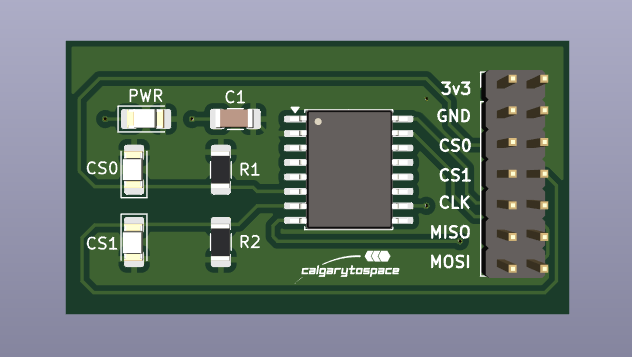
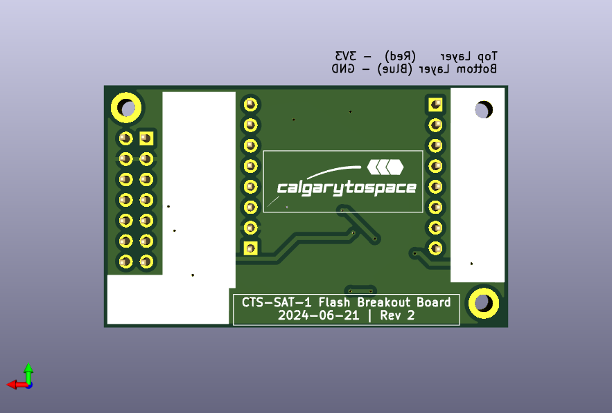

# CTS-SAT-1-Flash-Memory-Breakout
A breakout board for the CTS-SAT-1 flash memory module

The target memory module is the `S70FL01GSAGMFI011` (`S70`). This PCB is compatible with many similar memory modules in the same family.

## PCB Renderings

