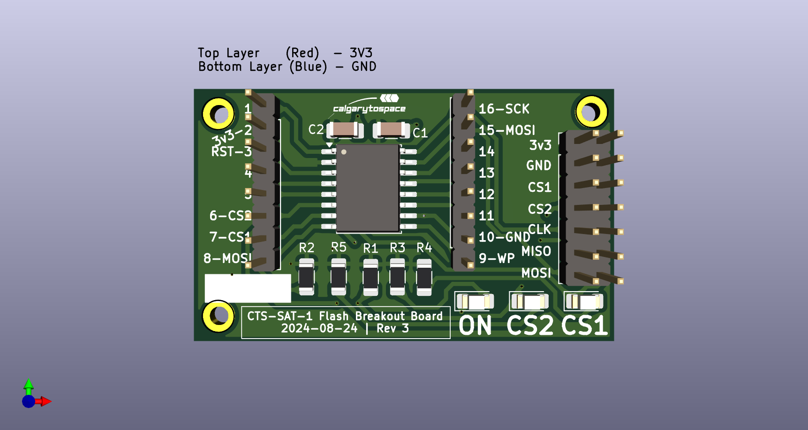
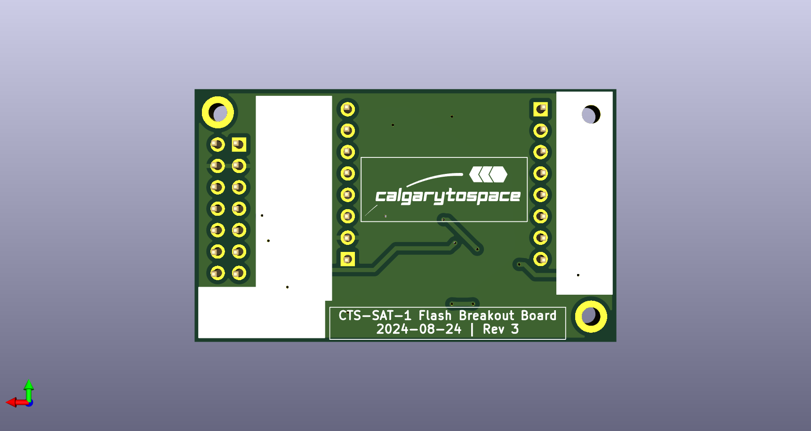

# CTS-SAT-1-Flash-Memory-Breakout

A breakout board for the CTS-SAT-1 flash memory module, used on the Onboard Computer (OBC) of the CTS-SAT-1 satellite.

The target memory modules is the `S70FL01GSAGMFI011` (`S70FL01`). This PCB is compatible with many similar memory modules in the same family.

This PCB is pin-compatible with the following memory modules:
* Infineon `S70FL01GSAGMFI011` (`S70FL01`)
* Infineon `S25FL512SDVFG1` (`S25FL512`)
* Cypress `25HL01GTFI01` (`25HL01`)

## PCB Renderings

